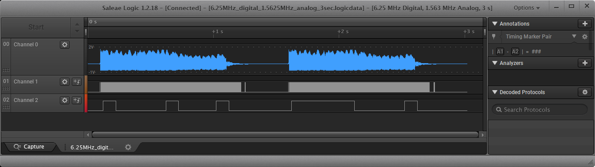
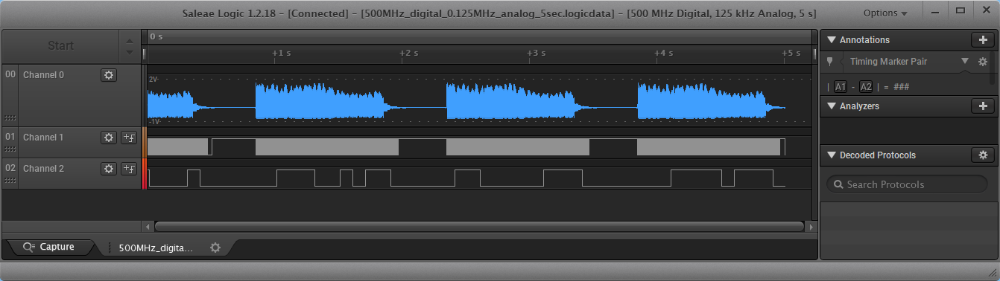

# Example for combining sigrok .sr files

As of PulseView 0.5.0-git-9d307c6 / libsigrok 0.6.0-git-d7df9dc, there is no facility, that would allow combining captures from .sr files.

For instance, in Audacity, which is an audio editor, but shares the visualisation of waveform tracks with PulseView, if the user does File/Import/Audio... once at first, a new session will be opened, and the audio tracks from the file will be added to this session. If the user then does File/Import/Audio... a second time, importing a second file, then the tracks from the second file will be added to the track list of the session - creating a session that contains the combination of the audio tracks from both files.

However, if the user does something similar in PulseView - a new session will be opened for each import, thereby making it impossible to create a session which contains waveforms/data from multiple files.

One of the essential things to note is that, Audacity can handle different sample rates for each track, while also having a sample rate for the entire project/session ( see e.g. https://superuser.com/questions/420531/audacity-resampling ; http://www.dynamicsoflanguage.edu.au/research/data-archives/guides/resampling-audio-using-audacity/ ) .

On the other hand, PulseView (at the time of writing, at least) assumes that there is a single sample rate used in the entire session; thus, in order to start considering merging different tracks/data into a single session in PulseView, we must first consider how to bring all this data under the same sampling rate - that is, we need to consider resampling.

In this example, we consider a simple Arduino application, driven by an analog signal and with output digital signals; this application will be captured by Saleae Logic in mixed mode (both analog and digital capture), which Saleae Logic typically captures with different sampling rates. Then we consider export from Saleae Logic into formats that can be imported into PulseView, from where we will save them as the native `.sr` format - which will also inherit the differing sampliing rates. Finally, we look into how can we resample the relevant data, so they are end up under the same sampling rate - which will facilitate merging all of this data into a single session.


## Data input

The audio waveform is a "chirp", generated by Audacity, using:

* Generate/Chirp: Waveform: Sine, Start: 440 Hz Amplitude 1.0, End: 1320 Hz Amplitude 1.0, Interpolation: Linear, Duration: 1 sec
* At end of the above chirp: Generate/Silence, 0.5 sec
* This is exported as 16-bit, 44100 Hz mono .wav file, `chirp_base.wav`.

When this file is reproduced out of the PC soundcard on max volume, a max ampliture of about ± 1.75 V can be measured on oscilloscope (note that Saleae Logic cannot measure the negative semiperiod below -1V!)


## Test Arduino schematic and code

The example Arduino code is taken from [Analog Comparator Interrupt](https://forum.arduino.cc/index.php?topic=149840.msg1135919#msg1135919) - and here it is implemented in [sketch_arduino_analog_comp_test/](sketch_arduino_analog_comp_test/).

The schematic that shows the routing for this test code is shown in [img/arduino_test_schematic.png](img/arduino_test_schematic.png).

The code sets up an analog comparator: the negative input of the comparator (Arduino pin 7) is held on ground, and it represents the comparison threshold at 0V; while the positive input of the comparator is driven by the (mono) channel of the audio, as reproduced by the PC. When the audio channel signal crosses the comparator threshold, an interrupt is raised, where pin 13 of the Arduino is toggled.

On the other hand, the Arduino main loop runs with a 100 ms delay (sleep), and whenever it runs, it copies the state of the comparator to Arduino pin 9.

Finally, with Saleae Logic, we capture the following signals:

* The channel audio, captured as analog signal, as Saleae Logic Ch.0 (usually marked with black color)
* The pin 13 of Arduino (here, as interrupt indicator), captured as digital signal, as Saleae Logic Ch.1 (usually marked with brown color)
* The pin 9 of Arduino (here, as "slow" comparator state indicator), captured as digital signal, as Saleae Logic Ch.2 (usually marked with red color)

When capturing in mixed mode (both analog and digital signals) with Saleae Logic 1.2.18, one cannot arbitrarily choose the sampling rates for analog and digital signals; so the following captures were performed of this test setup:

1. [data/6.25MHz_digital_1.5625MHz_analog_3sec.logicdata](data/6.25MHz_digital_1.5625MHz_analog_3sec.logicdata) - 6.25 MHz digital sampling rate, with 1.5625 MHz analog sampling rate, 3-second capture

    [](img/6.25MHz_digital_1.5625MHz_analog_3sec-Saleae_Logic.png)

2. [data/500MHz_digital_0.125MHz_analog_5sec.logicdata](data/500MHz_digital_0.125MHz_analog_5sec.logicdata) - 500 MHz digital sampling rate, with 125 kHz analog sampling rate, 5-second capture

    [](img/500MHz_digital_0.125MHz_analog_5sec-Saleae_Logic.png)


So - the goal of this exercise, is to bring all of these captures in a single PulseView session.


## Exporting from Saleae Logic

Since we made "mixed-mode" (analog & digital) captures in Saleae Logic, we have several options to export the data, so that we can import it in sigrok/PulseView; we can see these options by clicking Options/Export Data in Saleae Logic 1.2.18, once we have loaded a `.logicdata` file in it:

* Digital and Analog export - see [img/Saleae_Logic_Export_dg_an.png](img/Saleae_Logic_Export_dg_an.png)
    * Export to **Csv** `.csv` file
    * Export to **Matlab** `.mat` file

Note that the **Csv** import in sigrok/PulseView assumes that there is a single sampling rate; while the sigrok/PulseView .csv importer can interpret timestamps as floating-point seconds, it only does so to calculate the delta between two consecutive timestamps, and to derive the overall sampling rate from them; thus, timestamps are not interpreted "absolutely", and timestamp "gaps" (outside of the assumed sampling rate) in the .csv are not supported (see [sigrok / Thread: [sigrok-devel] How is the .csv import with timestamps in PulseView supposed to work?](https://sourceforge.net/p/sigrok/mailman/sigrok-devel/thread/3d80e3ed-c29a-e7d1-056e-50b8edba7156@brothers-sons.dk/))

However, if we export a "mixed-mode" .csv from Saleae Logic, we get a file like:

```
 Time [s],Channel 0-Analog, Time [s],Channel 1-Digital, Time [s],Channel 2-Digital
0.000000000000000, -0.038281224668026, 0.000000000000000, 0, 0.000000000000000, 0
0.000000640000000, -0.033183418214321, 0.096834720000000, 1, 0.123360000000000, 1
0.000001280000000, -0.033183418214321, 0.096855360000000, 0, 0.223311200000000, 0
0.000001920000000, -0.038281224668026, 0.096867840000000, 1, 0.623114400000000, 1
...
```

... or in other words, we have several timestamp columns, all of which have "gaps" - which is not likely to import correctly in sigrok/PulseView.

As far as the **Matlab** file format, sigrok/PulseView does not currently support it natively; there are Python libraries that can load Matlab `.mat` files ( using `from scipy.io import loadmat`; see https://towardsdatascience.com/how-to-load-matlab-mat-files-in-python-1f200e1287b5 ), however, that means we have to additionally write a converter from Matlab to sigrok format.

---------

So, let's see if there is an easier way to import this data into sigrok/PulseView - we can try exporting digital and analog data from Saleae Logic separately. The options here are (remember to set "Choose which channels to export" in the "Data Export" dialog in Saleae Logic first):

* Analog Only export - see [img/Saleae_Logic_Export_an.png](img/Saleae_Logic_Export_an.png)
    * Export to **Binary** `.bin` file
    * Export to **Csv** `.csv` file
    * Export to **Matlab** `.mat` file

For the Analog Only export, the **Matlab** - and the **Binary** - options present the same problem as earlier - we'd have to write a converter program, to get this data into sigrok/PulseView.

However, using the **Csv** export option should this time be fine - because the exported `.csv` file, for a single channel, looks like this:

```
Time[s], Channel 0
 Time [s],Channel 0-Analog
0.000000000000000, -0.038281224668026
0.000000640000000, -0.033183418214321
0.000001280000000, -0.033183418214321
0.000001920000000, -0.038281224668026
...
```

... which means the data is represented with timestamps at a constant sampling rate (without gaps) - meaning that sigrok/PulseView should be able to interpret it correctly.

So, let's say we've exported these `.csv` files from our source captures (as they are intermediary files, the `.csv` files are not saved in this repository):

* `6.25MHz_digital_1.5625MHz_analog_3sec.logicdata` -> `6.25MHz_digital_1.5625MHz_analog_3sec_an.csv`
* `500MHz_digital_0.125MHz_analog_5sec.logicdata` -> `500MHz_digital_0.125MHz_analog_5sec_an.csv`

We only have to delete one of the extra header lines (say, the ` Time [s],Channel 0-Analog` one) manually from the .csv files, and they should be ready for import in sigrok/PulseView.

First, let's check the file sizes (the below snippets have been ran under MSYS2 `bash` in MS Windows 10):

```
$ ls -la *_an.csv
-rw-r--r-- 1 user None  24M Oct 19 07:05 500MHz_digital_0.125MHz_analog_5sec_an.csv
-rw-r--r-- 1 user None 174M Oct 19 07:04 6.25MHz_digital_1.5625MHz_analog_3sec_an.csv
```

We can see that the file sizes are different - which is expected, since the two analog captures have been made at different sampling rates.

We can also do a quick check with sigrok and logging, to see how these files will be interpreted:

```
$ "C:\Program Files (x86)\sigrok\sigrok-cli\sigrok-cli.exe" \
  -l 3 -I csv:header=yes:column_formats=t,a \
  -i 500MHz_digital_0.125MHz_analog_5sec_an.csv \
  --show
cli: Received SR_DF_HEADER.
sr: input/csv: Cannot convert timestamp text 0.000000000000000 in line 2 (or zero value).
cli: Received SR_DF_META.
cli: Got samplerate 125000 Hz.
cli: Received SR_DF_ANALOG (626405 samples).
cli: Received SR_DF_END.
Samplerate: 125000
Channels: 1
-  Channel 0: analog
Analog sample count: 626405

$ "C:\Program Files (x86)\sigrok\sigrok-cli\sigrok-cli.exe" \
  -l 3 -I csv:header=yes:column_formats=t,a \
  -i 6.25MHz_digital_1.5625MHz_analog_3sec_an.csv \
  --show
cli: Received SR_DF_HEADER.
sr: input/csv: Cannot convert timestamp text 0.000000000000000 in line 2 (or zero value).
cli: Received SR_DF_META.
cli: Got samplerate 1562500 Hz.
cli: Received SR_DF_ANALOG (1048576 samples).
cli: Received SR_DF_ANALOG (1048576 samples).
cli: Received SR_DF_ANALOG (1048576 samples).
cli: Received SR_DF_ANALOG (1048576 samples).
cli: Received SR_DF_ANALOG (523949 samples).
cli: Received SR_DF_END.
Samplerate: 1562500
Channels: 1
-  Channel 0: analog
Analog sample count: 4718253
```

So, we can see that the analog sample rates have been derived correctly from the .csv file timestamps by the sigrok/PulseView .csv importer.

Now, we can start PulseView, and import these .csv's there, and then export the sigrok `.sr` session files corresponding to them - again, since upon each import, PulseView will start a new session, we will obtain (in this case) one `.sr` file for each `.csv` file (each of which contains data for a single analog channel).

In PulseView, just click "Import Comma-separated values...", and then just type `t,a` in the subsequent "Import Comma-separated values" dialog (see [img/PulseView_csv_import_analog.png](img/PulseView_csv_import_analog.png)). The data will be imported, and then you can click Save As, and choose "Save as type:" "srzip session file format data files (*.sr)".

Or, we can use the command line directly:

```
"C:\Program Files (x86)\sigrok\sigrok-cli\sigrok-cli.exe" \
  -l 3 -I csv:header=yes:column_formats=t,a \
  -i 500MHz_digital_0.125MHz_analog_5sec_an.csv \
  -o 500MHz_digital_0.125MHz_analog_5sec_an.sr

"C:\Program Files (x86)\sigrok\sigrok-cli\sigrok-cli.exe" \
  -l 3 -I csv:header=yes:column_formats=t,a \
  -i 6.25MHz_digital_1.5625MHz_analog_3sec_an.csv \
  -o 6.25MHz_digital_1.5625MHz_analog_3sec_an.sr
```

These files are included in this repository:

* [data/500MHz_digital_0.125MHz_analog_5sec_an.sr](data/500MHz_digital_0.125MHz_analog_5sec_an.sr)
* [data/6.25MHz_digital_1.5625MHz_analog_3sec_an.sr](data/6.25MHz_digital_1.5625MHz_analog_3sec_an.sr)

A quick check of the filesizes:

```
$ ls -la *_an.sr
-rw-r--r-- 1 user None 490K Oct 19 07:25 500MHz_digital_0.125MHz_analog_5sec_an.sr
-rw-r--r-- 1 user None 1.4M Oct 19 07:27 6.25MHz_digital_1.5625MHz_analog_3sec_an.sr
```

... and let's restate again, that these two files each have a single channel of analog data - however, at different sampling rates.

---------

Now, let's export the digital channels, from our Saleae Logic captures, into sigrok/PulseView `.sr` files. The Saleae Logic options here are:

* Digital Only export - see [img/Saleae_Logic_Export_dg.png](img/Saleae_Logic_Export_dg.png)
    * Export to **Binary** `.bin` file
    * Export to **Csv** `.csv` file
    * Export to **Vcd** `.vcd` file
    * Export to **Matlab** `.mat` file

For the Digital Only export, the **Matlab** - and the **Binary** - options present the same problem as earlier - we'd have to write a converter program, to get this data into sigrok/PulseView.

The **Vcd** (see https://en.wikipedia.org/wiki/Value_change_dump) export typically works fine in this case, without having to set any options - and typically sigrok/PulseView can import digital data from a .vcd without a problem.

As far as the **Csv** export is concerned: if we choose the "Use timestamps [s]" option in the "CSV Settings", then we'll get a file like:

```
Time[s], Channel 1, Channel 2
0.000000000000000, 1, 1
0.000174486000000, 0, 1
0.000661762000000, 1, 1
0.000674068000000, 0, 1
0.001168152000000, 1, 1
...
```

... which quite clearly has gaps - which means it will not be imported correctly in sigrok/PulseView.

However, if we use the "Use sample numbers" option instead, we get a file like:

```
Sample, Channel 1, Channel 2
0, 1, 1
87243, 0, 1
330881, 1, 1
337034, 0, 1
584076, 1, 1
...
```

... which again is a .csv file with gaps - which means it will not be imported correctly in sigrok/PulseView.

So, our only option here, is to export the digital data from the Saleae Logic captures as a `.vcd` file.

So, let's say we've exported these `.vcd` files from our source captures (as they are intermediary files, the `.vcd` files are not saved in this repository):

* `6.25MHz_digital_1.5625MHz_analog_3sec.logicdata` -> `6.25MHz_digital_1.5625MHz_analog_3sec_dg.vcd`
* `500MHz_digital_0.125MHz_analog_5sec.logicdata` -> `6.25MHz_digital_1.5625MHz_analog_3sec_dg.vcd`

Again, let's check the file sizes:

```
$ ls -la *_dg.vcd
-rw-r--r-- 1 user None 192K Oct 19 07:50 500MHz_digital_0.125MHz_analog_5sec_dg.vcd
-rw-r--r-- 1 user None 105K Oct 19 07:51 6.25MHz_digital_1.5625MHz_analog_3sec_dg.vcd
```

Since `.vcd` is a text file format, it is interesting to see one property of these .vcd files:

```
$ grep -r 'timescale' . --include='*.vcd'
./500MHz_digital_0.125MHz_analog_5sec_dg.vcd:$timescale 1 ns $end
./6.25MHz_digital_1.5625MHz_analog_3sec_dg.vcd:$timescale 1 ns $end
```

The `$timescale` parameter can be seen as an implied sampling rate of the data in the file; note that, while the original digital captures were done at 500MHz and 6.25MHz respective sampling rates - the data from both, due to the `$timescale` VCD parameter, will be intepreted by sigrok/PulseView to have been captured at 1/1e-9 = 1 GHz sampling rate!

We can also inspect the resulting .vcd files using `sigrok` (see also: https://sigrok.org/wiki/File_format:Vcd) - which will confirm the 1 GHz sampling rate interpretation:

```
$ "C:\Program Files (x86)\sigrok\sigrok-cli\sigrok-cli.exe" -i 500MHz_digital_0.125MHz_analog_5sec_dg.vcd --show Samplerate: 1000000000
Channels: 2
- top.Channel_1: logic
- top.Channel_2: logic
Logic unitsize: 1
Logic sample count: 5008344477

$ "C:\Program Files (x86)\sigrok\sigrok-cli\sigrok-cli.exe" -i 6.25MHz_digital_1.5625MHz_analog_3sec_dg.vcd --show
Samplerate: 1000000000
Channels: 2
- top.Channel_1: logic
- top.Channel_2: logic
Logic unitsize: 1
Logic sample count: 2759602561
```


Again, we can either use PulseView to import the `.vcd` files, and to export `.sr` files - or, we can use `sigrok` from the command like (note, this process takes a while, maybe a couple of minutes - regardless of which approach we choose):

```
"C:\Program Files (x86)\sigrok\sigrok-cli\sigrok-cli.exe" \
  -l 3 \
  -i 500MHz_digital_0.125MHz_analog_5sec_dg.vcd \
  -o 500MHz_digital_0.125MHz_analog_5sec_dg.sr

"C:\Program Files (x86)\sigrok\sigrok-cli\sigrok-cli.exe" \
  -l 3 \
  -i 6.25MHz_digital_1.5625MHz_analog_3sec_dg.vcd \
  -o 6.25MHz_digital_1.5625MHz_analog_3sec_dg.sr
```

These files are included in this repository:

* [data/500MHz_digital_0.125MHz_analog_5sec_dg.sr](data/500MHz_digital_0.125MHz_analog_5sec_dg.sr)
* [data/6.25MHz_digital_1.5625MHz_analog_3sec_dg.sr](data/6.25MHz_digital_1.5625MHz_analog_3sec_dg.sr)

A quick check of the filesizes:

```
$ ls -la *_dg.sr
-rw-r--r-- 1 user None 4.8M Oct 19 08:06 500MHz_digital_0.125MHz_analog_5sec_dg.sr
-rw-r--r-- 1 user None 2.7M Oct 19 08:07 6.25MHz_digital_1.5625MHz_analog_3sec_dg.sr
```


## Merging/combining the .sr files into a single sigrok/PulseView session

So, from our two mixed-mode (analog & digital) Saleae Logic captures, we obtained four `.sr` files - two with analog data, and two with digital data, all of which having (in principle) differing sampling rates. Let's check them again through the command line:

```
$ for ifile in *.sr; do echo $ifile; "C:\Program Files (x86)\sigrok\sigrok-cli\sigrok-cli.exe" -i $ifile --show; echo; done
500MHz_digital_0.125MHz_analog_5sec_an.sr
Samplerate: 125000
Channels: 1
-  Channel 0: analog
Analog sample count: 626405

500MHz_digital_0.125MHz_analog_5sec_dg.sr
Samplerate: 1000000000
Channels: 2
- top.Channel_1: logic
- top.Channel_2: logic
Logic unitsize: 1
Logic sample count: 5008344477

6.25MHz_digital_1.5625MHz_analog_3sec_an.sr
Samplerate: 1562500
Channels: 1
-  Channel 0: analog
Analog sample count: 4718253

6.25MHz_digital_1.5625MHz_analog_3sec_dg.sr
Samplerate: 1000000000
Channels: 2
- top.Channel_1: logic
- top.Channel_2: logic
Logic unitsize: 1
Logic sample count: 2759602561
```

So, in order to bring all of these `.sr` files into the same session, we have to generally handle the following problems:

* All of the data files need to be on the same sampling rate
* The channel names need to be changed so they are unique in the new, merged, session scope

The sigrok `.sr` file format is documented at https://sigrok.org/wiki/File_format:Sigrok/v2 - which informs us, that `.sr` (of the current version at time of writing, which is V2) files are essentially ZIP archives.

Regarding the sampling rate, the most straightforward solution is to find the largest sampling rate, and then resample all data to this sampling rate. We have already determined that our files use rates of 125000, 1562500 and 1000000000 Hz - thus, the most straightforward solution is to resample the 125000 and 1562500 Hz analog signals to 1000000000 Hz. Clearly, this will result with a *****massive***** file size increase - especially since in this case, we are to resample analog data.

Furthermore, we'd need to choose whether we want interpolation of analog samples upon resampling, or not. Thankfully, the relationships between the sampling rates are:

* 1000000000/125000 = 8000
* 1000000000/1562500 = 640

... or in other words, they are integer ratios - so a resampling without interpolation would simply involve repeating a sample an integet number of times.

Note that sigrok (or rather, `libsigrok`) has a Python API: https://www.sigrok.org/api/libsigrok/0.5.0/bindings/python/ - and there is a Python example of using this API at https://github.com/martinling/sigrok-cli-python ; however, the Windows installers https://sigrok.org/wiki/Windows#Windows_installers for sigrok/PulseView are static, so no shared (.dll) libsigrok libraries are available from these installers (and consequently, no Python libraries either). So, in order to get these bindings on Windows, we'd have to build `libsigrok` from source - however https://sigrok.org/wiki/Windows#Native_build_using_MSYS2 states that:

> **NOT yet working**: libsigrok Python/Ruby/Java bindings [...]

... and indeed, as of time of this writing, there are problems compiling in this setup (see [msys2_mingw64_sigrok_build_log.md](msys2_mingw64_sigrok_build_log.md)

So, we need to go few steps back: since the digital data .vcd files are both already on 1 GHz sampling rate, all we need to do is, to upsample the analog data .csv files to 1 GHz as well.

Thankfully, it is relatively easy to resample .csv files, that are in the format in this example, using the [pandas](https://pandas.pydata.org/) Python library. This repository contains one script that does that:

    python3 code/resample_csv_pandas.py data/500MHz_digital_0.125MHz_analog_5sec_an.csv

However, note that this script is so memory hungry, it will most likely cause your system to hang or freeze (or fail with `MemoryError: Unable to allocate 37.3 GiB for an array with shape (5011232001,) and data type int64`).


